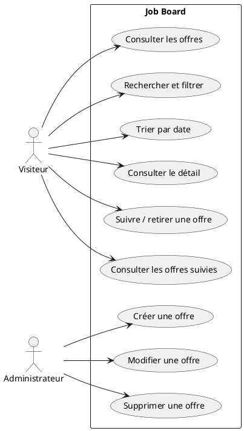

# Diagramme de cas d'utilisation

Les cas couvrent les parcours publics et la gestion des offres présente dans l'application.

```plantuml
@startuml
left to right direction
actor Visiteur
actor Administrateur

rectangle "Job Board" {
  usecase "Consulter les offres" as UC1
  usecase "Rechercher et filtrer" as UC2
  usecase "Trier par date" as UC3
  usecase "Consulter le détail" as UC4
  usecase "Suivre / retirer une offre" as UC5
  usecase "Consulter les offres suivies" as UC6
  usecase "Créer une offre" as UC7
  usecase "Modifier une offre" as UC8
  usecase "Supprimer une offre" as UC9
}

Visiteur --> UC1
Visiteur --> UC2
Visiteur --> UC3
Visiteur --> UC4
Visiteur --> UC5
Visiteur --> UC6
Administrateur --> UC7
Administrateur --> UC8
Administrateur --> UC9
@enduml
```