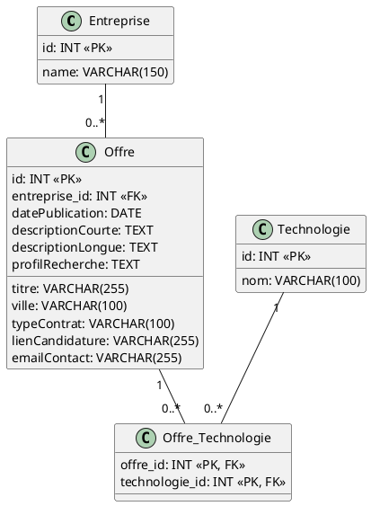

# Diagramme de classes UML

Ce diagramme reprend les quatre tables et leurs clés telles qu'elles sont définies dans `database/schema.sql`.

```plantuml
@startuml
class Entreprise {
  id: INT <<PK>>
  name: VARCHAR(150)
}

class Offre {
  id: INT <<PK>>
  entreprise_id: INT <<FK>>
  titre: VARCHAR(255)
  ville: VARCHAR(100)
  typeContrat: VARCHAR(100)
  datePublication: DATE
  descriptionCourte: TEXT
  descriptionLongue: TEXT
  profilRecherche: TEXT
  lienCandidature: VARCHAR(255)
  emailContact: VARCHAR(255)
}

class Technologie {
  id: INT <<PK>>
  nom: VARCHAR(100)
}

class Offre_Technologie {
  offre_id: INT <<PK, FK>>
  technologie_id: INT <<PK, FK>>
}

Entreprise "1" -- "0..*" Offre
Offre "1" -- "0..*" Offre_Technologie
Technologie "1" -- "0..*" Offre_Technologie
@enduml
```